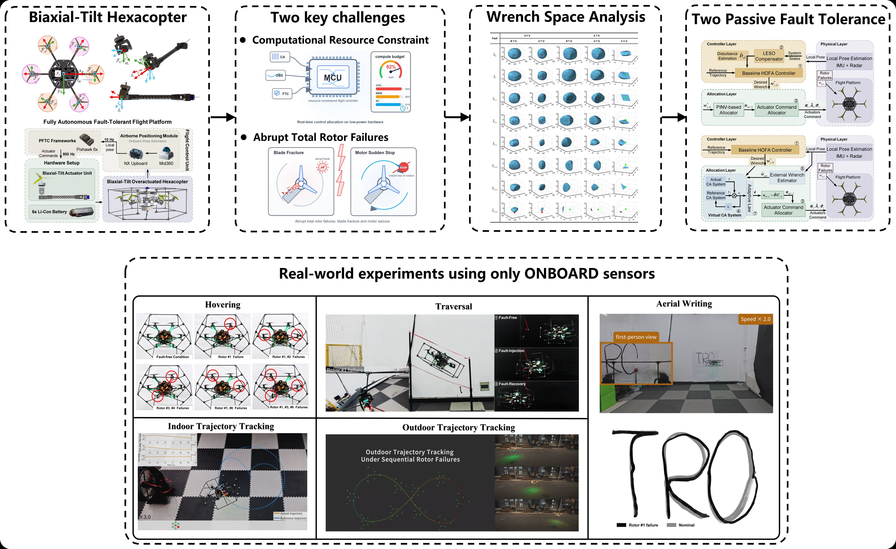
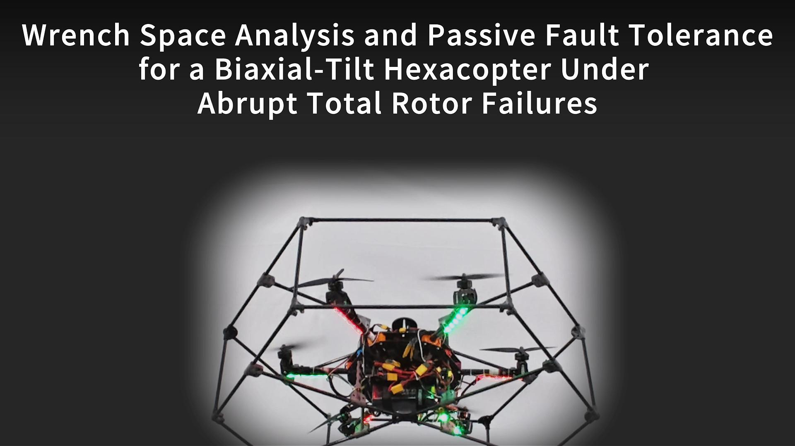
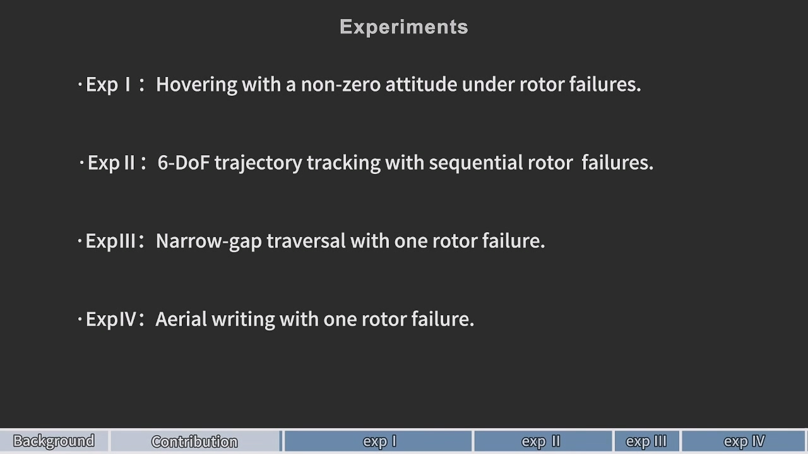
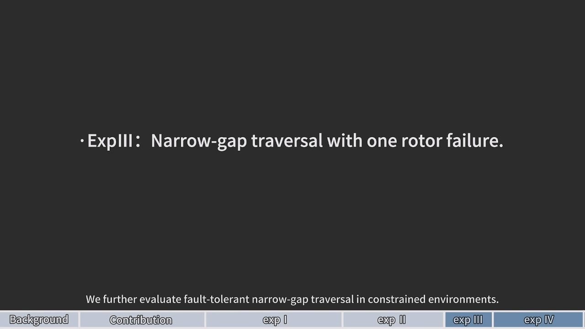
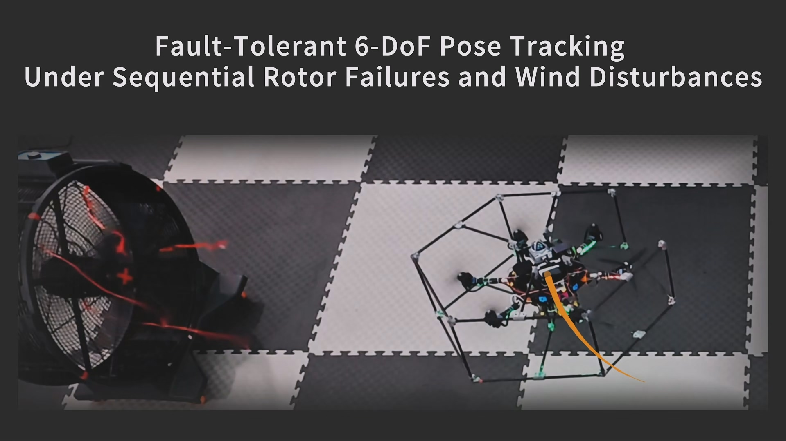
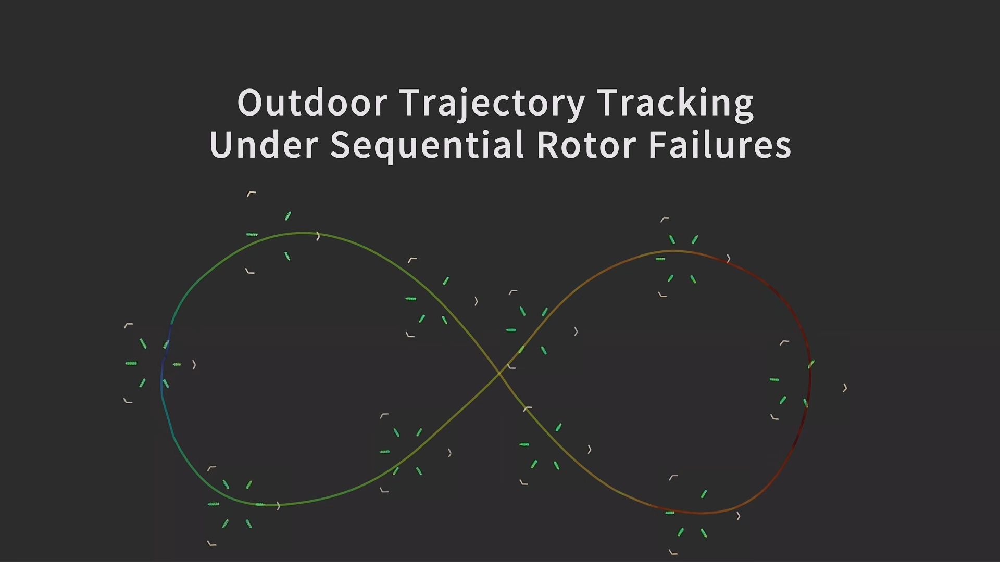
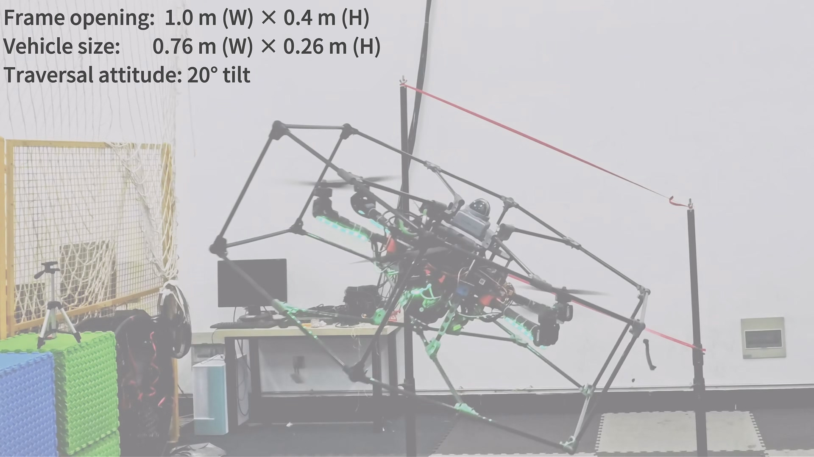
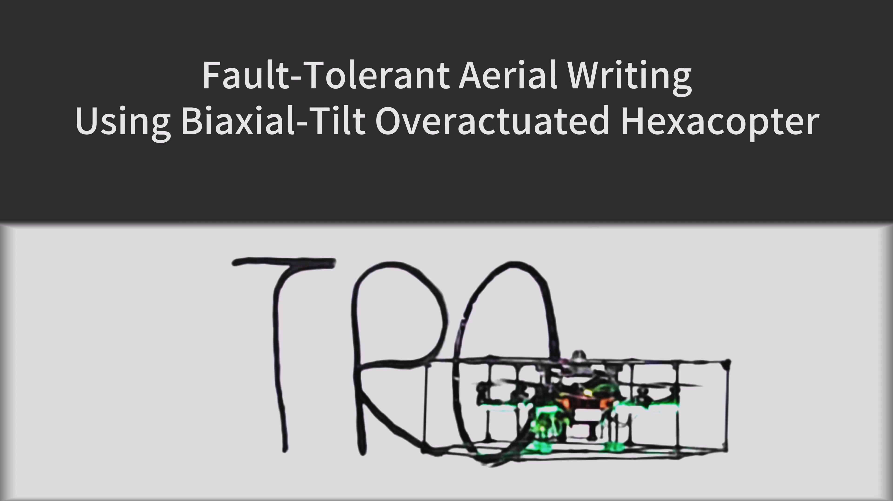
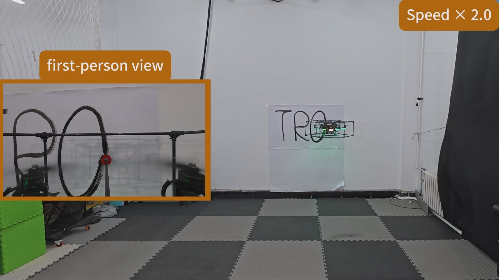
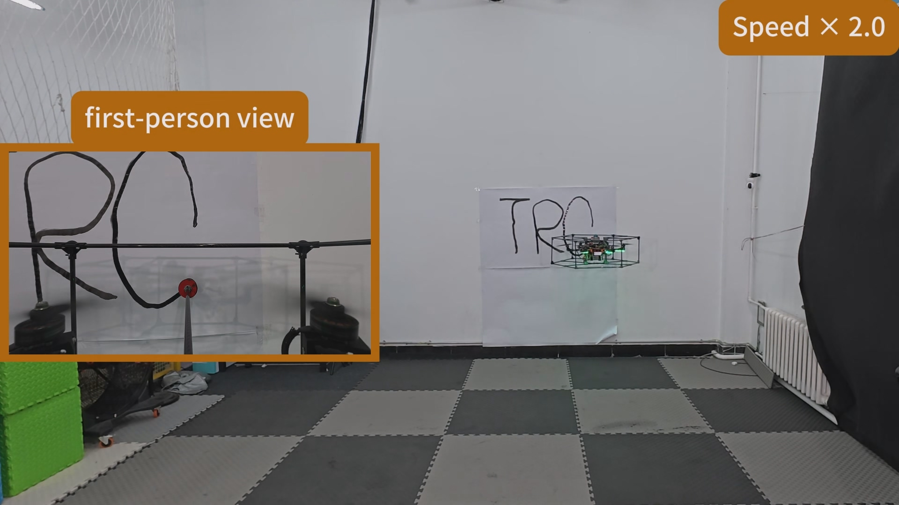

# Preserving Full 6-DOF Actuation Under Abrupt Total Rotor Failures: Passive Fault-Tolerant Flight Control Using a Biaxial-Tilt Hexacopter

  Supplementary materials overview presented directly in the repository README.

  <a href="#main-video"><strong>Main Video</strong></a>
  |
  <a href="#experiment-highlights"><strong>Experiment Highlights</strong></a>
  |
  <a href="#extended-hovering-results"><strong>Extended Hovering Results</strong></a>

  

  <strong>Overview of the biaxial-tilt hexacopter, the wrench-space analysis, the two passive fault-tolerant control architectures, and representative onboard-sensor-only experiments.</strong>

## Abstract

Conventional multirotors suffer from a rapid collapse of attainable wrench space (AWS) under abrupt total rotor failures, rendering full 6-DOF recovery physically impossible. This work studies passive fault-tolerant flight of a biaxial-tilt overactuated hexacopter (BTO) under abrupt total rotor failures that are a priori unknown to the controller. The analysis focuses on representative abrupt rotor-failure cases for which the post-failure system remains fully actuated, without assuming explicit fault detection, isolation, or fault-mode switching. We extend the inscribed-sphere metric of the AWS by incorporating the transient-wrench-jump term, enabling quantitative feasibility assessment under up to three simultaneous rotor failures and benchmarking against uniaxial-tilt and coplanar hexacopters. We further develop two computationally efficient passive schemes without fault detection or online optimization: a controller-layer design that combines a high-order fully actuated (HOFA) controller with a linear extended state observer (LESO), and an allocator-layer design based on model-reference adaptive control allocation with momentum-based wrench estimation. Simulations and flight experiments validate stable hovering and 6-DOF trajectory tracking under single and multiple rotor failures. Additional onboard-sensor-only experiments, including indoor tracking under wind disturbance, outdoor tracking under extreme conditions, narrow-frame traversal, and contact-based aerial writing, further demonstrate robustness in challenging environments.

## At a Glance

- The biaxial-tilt overactuated hexacopter preserves substantially larger post-failure recovery margins than uniaxial-tilt and coplanar designs.
- The paper introduces an AWS feasibility metric that accounts for transient wrench jumps under abrupt rotor failures.
- Two passive fault-tolerant strategies are developed: one at the controller layer and one at the allocation layer.
- Flight experiments validate hovering, trajectory tracking, gate traversal, and contact-rich aerial writing under single and multiple rotor failures.

## Main Video

Each poster below opens the corresponding MP4 clip stored in this repository.

<table>
  <tr>
    <td align="center" valign="top" width="33.33%">
      
       
      <strong>Main Video - Overview</strong>
       
      Problem setting, key challenges, and main technical contributions.
    </td>
    <td align="center" valign="top" width="33.33%">
      
       
      <strong>Main Video - Part I</strong>
       
      Hovering and trajectory-tracking experiments under single and multiple rotor failures.
    </td>
    <td align="center" valign="top" width="33.33%">
      
       
      <strong>Main Video - Part II</strong>
       
      Narrow-frame traversal and contact-based aerial writing under rotor-failure conditions.
    </td>
  </tr>
</table>

## Experiment Highlights

The sections below keep the most visual parts of the supplementary materials directly inside the README while staying compatible with GitHub's static rendering.

### Indoor Trajectory Tracking

Indoor trajectory tracking under 5 m/s wind disturbance is used to evaluate post-failure full-pose regulation and disturbance rejection.

<table>
  <tr>
    <td align="center" width="50%">
      
       
      <strong>Experiment Video</strong>
    </td>
    <td align="center" width="50%">
      
       
      <strong>Tracking Error Statistics</strong>
    </td>
  </tr>
</table>

### Outdoor Trajectory Tracking

Outdoor trajectory tracking is evaluated in low-temperature conditions with stochastic wind disturbance to demonstrate robustness in more realistic operating environments.

<table>
  <tr>
    <td align="center" width="50%">
      
       
      <strong>Experiment Video</strong>
    </td>
    <td align="center" width="50%">
      
       
      <strong>Tracking Error Statistics</strong>
    </td>
  </tr>
</table>

### Gate Traversal

In the tilted narrow-frame traversal task, the vehicle passes through the aperture while maintaining a prescribed fixed attitude instead of relying on aggressive attitude maneuvers.

<table>
  <tr>
    <td align="center" width="50%">
      
       
      <strong>Experiment Video</strong>
    </td>
    <td align="center" width="50%">
      
       
      <strong>Tracking Comparison</strong>
    </td>
  </tr>
</table>

### Aerial Writing

Aerial writing is a representative contact-rich aerial-operation task that requires sustained wall contact and accurate full-pose regulation.

<table>
  <tr>
    <td align="center" width="50%">
      
       
      <strong>Featured Writing Demonstration</strong>
    </td>
    <td align="center" width="50%">
      
       
      <strong>Result Snapshot</strong>
    </td>
  </tr>
</table>

<table>
  <tr>
    <td align="center" width="50%">
      
       
      <strong>Without Rotor Failure</strong>
    </td>
    <td align="center" width="50%">
      
       
      <strong>With Rotor Failure</strong>
    </td>
  </tr>
</table>

## Extended Hovering Results

The hovering comparisons are condensed into expandable tables so the repository homepage stays readable while still exposing all experiment entries.

### 0 deg hovering comparison

Representative case images are reused for symmetric failure sets that share the same clip.

| Failure case | Reference | BTO-CL | BTO-AL | UTO-CL | UTO-AL |
| --- | --- | --- | --- | --- | --- |
| `1 / 4 / 5` |  | [Success](docs/assets/videos/hover/0deg/BTO-CL/1.mp4) | [Success](docs/assets/videos/hover/0deg/BTO-AL/1.mp4) | [Success](docs/assets/videos/hover/0deg/UTO-CL/1.mp4) | [Success](docs/assets/videos/hover/0deg/UTO-AL/1.mp4) |
| `12 / 34` |  | [Success](docs/assets/videos/hover/0deg/BTO-CL/12.mp4) | [Success](docs/assets/videos/hover/0deg/BTO-AL/12.mp4) | [Success](docs/assets/videos/hover/0deg/UTO-CL/12.mp4) | [Success](docs/assets/videos/hover/0deg/UTO-AL/12.mp4) |
| `13 / 16 / 36` |  | [Failure](docs/assets/videos/hover/0deg/BTO-CL/13.mp4) | [Success](docs/assets/videos/hover/0deg/BTO-AL/13.mp4) | [Failure](docs/assets/videos/hover/0deg/UTO-CL/13.mp4) | [Success](docs/assets/videos/hover/0deg/UTO-AL/13.mp4) |
| `136` |  | [Failure](docs/assets/videos/hover/0deg/BTO-CL/136.mp4) | [Success](docs/assets/videos/hover/0deg/BTO-AL/136.mp4) | [Failure](docs/assets/videos/hover/0deg/UTO-CL/136.mp4) | [Success](docs/assets/videos/hover/0deg/UTO-AL/136.mp4) |

### 45 deg hovering comparison

| Failure case | Reference | BTO-CL | BTO-AL | UTO-CL | UTO-AL |
| --- | --- | --- | --- | --- | --- |
| `1` |  | [Success](docs/assets/videos/hover/45deg/BTO-CL/1.mp4) | [Success](docs/assets/videos/hover/45deg/BTO-AL/1.mp4) | [Failure](docs/assets/videos/hover/45deg/UTO-CL/1.mp4) | [Failure](docs/assets/videos/hover/45deg/UTO-AL/1.mp4) |
| `4` |  | [Success](docs/assets/videos/hover/45deg/BTO-CL/4.mp4) | [Success](docs/assets/videos/hover/45deg/BTO-AL/4.mp4) | [Failure](docs/assets/videos/hover/45deg/UTO-CL/4.mp4) | [Success](docs/assets/videos/hover/45deg/UTO-AL/4.mp4) |
| `5` |  | [Success](docs/assets/videos/hover/45deg/BTO-CL/5.mp4) | [Success](docs/assets/videos/hover/45deg/BTO-AL/5.mp4) | [Success](docs/assets/videos/hover/45deg/UTO-CL/5.mp4) | [Success](docs/assets/videos/hover/45deg/UTO-AL/5.mp4) |
| `12` |  | [Failure](docs/assets/videos/hover/45deg/BTO-CL/12.mp4) | [Success](docs/assets/videos/hover/45deg/BTO-AL/12.mp4) | [Failure](docs/assets/videos/hover/45deg/UTO-CL/12.mp4) | [Failure](docs/assets/videos/hover/45deg/UTO-AL/12.mp4) |
| `34` |  | [Failure](docs/assets/videos/hover/45deg/BTO-CL/34.mp4) | [Success](docs/assets/videos/hover/45deg/BTO-AL/34.mp4) | [Failure](docs/assets/videos/hover/45deg/UTO-CL/34.mp4) | [Success](docs/assets/videos/hover/45deg/UTO-AL/34.mp4) |
| `13` |  | [Failure](docs/assets/videos/hover/45deg/BTO-CL/13.mp4) | [Success](docs/assets/videos/hover/45deg/BTO-AL/13.mp4) | [Failure](docs/assets/videos/hover/45deg/UTO-CL/13.mp4) | [Failure](docs/assets/videos/hover/45deg/UTO-AL/13.mp4) |
| `16` |  | [Failure](docs/assets/videos/hover/45deg/BTO-CL/16.mp4) | [Success](docs/assets/videos/hover/45deg/BTO-AL/16.mp4) | [Failure](docs/assets/videos/hover/45deg/UTO-CL/16.mp4) | [Success](docs/assets/videos/hover/45deg/UTO-AL/16.mp4) |
| `36` |  | [Failure](docs/assets/videos/hover/45deg/BTO-CL/36.mp4) | [Success](docs/assets/videos/hover/45deg/BTO-AL/36.mp4) | [Failure](docs/assets/videos/hover/45deg/UTO-CL/36.mp4) | [Failure](docs/assets/videos/hover/45deg/UTO-AL/36.mp4) |
| `136` |  | [Failure](docs/assets/videos/hover/45deg/BTO-CL/136.mp4) | [Success](docs/assets/videos/hover/45deg/BTO-AL/136.mp4) | [Failure](docs/assets/videos/hover/45deg/UTO-CL/136.mp4) | [Success](docs/assets/videos/hover/45deg/UTO-AL/136.mp4) |

## Notes

- GitHub README files cannot preserve the full CSS and JavaScript behavior of the original page, so videos are presented here as clickable posters and compact tables.
