# Preserving Full 6-DOF Actuation Under Abrupt Total Rotor Failures: Passive Fault-Tolerant Flight Control Using a Biaxial-Tilt Hexacopter

  Supplementary materials overview presented directly in the repository README.

  <a href="#main-video"><strong>Main Video</strong></a>
  |
  <a href="#experiment-highlights"><strong>Experiment Highlights</strong></a>
  |
  <a href="#extended-hovering-results"><strong>Extended Hovering Results</strong></a>

  

  <strong>Overview of the biaxial-tilt hexacopter, the wrench-space analysis, the two passive fault-tolerant control architectures, and representative onboard-sensor-only experiments.</strong>

## Abstract

Conventional multirotors suffer from a rapid collapse of attainable wrench space (AWS) under abrupt total rotor failures, rendering full 6-DOF recovery physically impossible. This work studies passive fault-tolerant flight of a biaxial-tilt overactuated hexacopter (BTO) under abrupt total rotor failures that are a priori unknown to the controller. The analysis focuses on representative abrupt rotor-failure cases for which the post-failure system remains fully actuated, without assuming explicit fault detection, isolation, or fault-mode switching. We extend the inscribed-sphere metric of the AWS by incorporating the transient-wrench-jump term, enabling quantitative feasibility assessment under up to three simultaneous rotor failures and benchmarking against uniaxial-tilt and coplanar hexacopters. We further develop two computationally efficient passive schemes without fault detection or online optimization: a controller-layer design that combines a high-order fully actuated (HOFA) controller with a linear extended state observer (LESO), and an allocator-layer design based on model-reference adaptive control allocation with momentum-based wrench estimation. Simulations and flight experiments validate stable hovering and 6-DOF trajectory tracking under single and multiple rotor failures. Additional onboard-sensor-only experiments, including indoor tracking under wind disturbance, outdoor tracking under extreme conditions, narrow-frame traversal, and contact-based aerial writing, further demonstrate robustness in challenging environments.

## At a Glance

- The biaxial-tilt overactuated hexacopter preserves substantially larger post-failure recovery margins than uniaxial-tilt and coplanar designs.
- The paper introduces an AWS feasibility metric that accounts for transient wrench jumps under abrupt rotor failures.
- Two passive fault-tolerant strategies are developed: one at the controller layer and one at the allocation layer.
- Flight experiments validate hovering, trajectory tracking, gate traversal, and contact-rich aerial writing under single and multiple rotor failures.

## Main Video

All embedded videos below are low-resolution previews for quick viewing in the README. Readers can download the high-resolution versions from the links provided beneath each preview. Preview media in this README use fixed display widths for more consistent viewing across different screen sizes.

<table>
  <tr>
    <td align="center" valign="top" width="33.33%">
      <video controls preload="metadata" playsinline poster="docs/assets/posters/main/main_overview_1080p.jpg" width="320">
        <source src="docs/assets/videos/main/main_overview_preview_360p.mp4" type="video/mp4">
        Your viewer does not support embedded video. Please use the download links below.
      </video>
       
      <a href="docs/assets/videos/main/main_overview_preview_360p.mp4">Preview Video (360p)</a>
       
      <a href="docs/assets/videos/main/main_overview_1080p.mp4">High-resolution download</a>
       
      <strong>Main Video - Overview</strong>
       
      Problem setting, key challenges, and main technical contributions.
    </td>
    <td align="center" valign="top" width="33.33%">
      <video controls preload="metadata" playsinline poster="docs/assets/posters/main/main_part_1_720p.jpg" width="320">
        <source src="docs/assets/videos/main/main_part_1_preview_360p.mp4" type="video/mp4">
        Your viewer does not support embedded video. Please use the download links below.
      </video>
       
      <a href="docs/assets/videos/main/main_part_1_preview_360p.mp4">Preview Video (360p)</a>
       
      <a href="docs/assets/videos/main/main_part_1_720p.mp4">High-resolution download</a>
       
      <strong>Main Video - Part I</strong>
       
      Hovering and trajectory-tracking experiments under single and multiple rotor failures.
    </td>
    <td align="center" valign="top" width="33.33%">
      <video controls preload="metadata" playsinline poster="docs/assets/posters/main/main_part_2_720p.jpg" width="320">
        <source src="docs/assets/videos/main/main_part_2_preview_360p.mp4" type="video/mp4">
        Your viewer does not support embedded video. Please use the download links below.
      </video>
       
      <a href="docs/assets/videos/main/main_part_2_preview_360p.mp4">Preview Video (360p)</a>
       
      <a href="docs/assets/videos/main/main_part_2_720p.mp4">High-resolution download</a>
       
      <strong>Main Video - Part II</strong>
       
      Narrow-frame traversal and contact-based aerial writing under rotor-failure conditions.
    </td>
  </tr>
</table>

## Experiment Highlights

The sections below keep the most visual parts of the supplementary materials directly inside the README while staying compatible with static repository rendering. All experiments shown here are conducted using onboard sensors only, without external positioning devices or infrastructure, to evaluate robustness in realistic and challenging operating conditions.

### Indoor Trajectory Tracking

Indoor trajectory tracking under 5 m/s wind disturbance is used to evaluate post-failure full-pose regulation and disturbance rejection.

<table>
  <tr>
    <td align="center" valign="top" width="50%">
      <video controls preload="metadata" playsinline poster="docs/assets/posters/trajectory/trajectory_01.jpg" width="480">
        <source src="docs/assets/videos/trajectory/trajectory_01_preview_360p.mp4" type="video/mp4">
        Your viewer does not support embedded video. Please use the download links below.
      </video>
       
      <a href="docs/assets/videos/trajectory/trajectory_01_preview_360p.mp4">Preview Video (360p)</a>
       
      <a href="docs/assets/videos/trajectory/trajectory_01.mp4">High-resolution download</a>
       
      <strong>Experiment Video</strong>
    </td>
    <td align="center" valign="top" width="50%">
      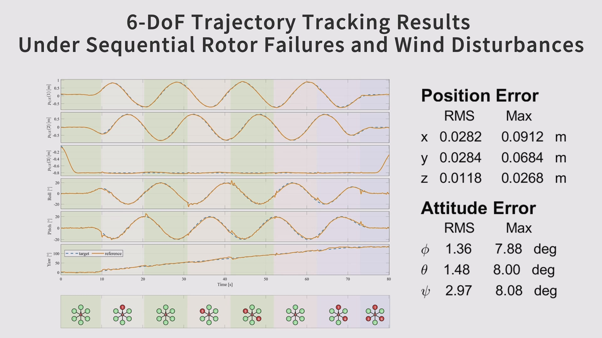
       
      <strong>Tracking Error Statistics</strong>
    </td>
  </tr>
</table>

### Outdoor Trajectory Tracking

Outdoor trajectory tracking is evaluated in low-temperature conditions with stochastic wind disturbance to demonstrate robustness in more realistic operating environments.

<table>
  <tr>
    <td align="center" valign="top" width="50%">
      <video controls preload="metadata" playsinline poster="docs/assets/posters/outdoor/outdoor_01.jpg" width="480">
        <source src="docs/assets/videos/outdoor/outdoor_01_preview_360p.mp4" type="video/mp4">
        Your viewer does not support embedded video. Please use the download links below.
      </video>
       
      <a href="docs/assets/videos/outdoor/outdoor_01_preview_360p.mp4">Preview Video (360p)</a>
       
      <a href="docs/assets/videos/outdoor/outdoor_01.mp4">High-resolution download</a>
       
      <strong>Experiment Video</strong>
    </td>
    <td align="center" valign="top" width="50%">
      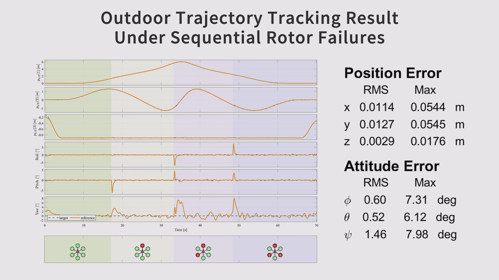
       
      <strong>Tracking Error Statistics</strong>
    </td>
  </tr>
</table>

### Gate Traversal

In the tilted narrow-frame traversal task, the vehicle passes through the aperture while maintaining a prescribed fixed attitude instead of relying on aggressive attitude maneuvers.

<table>
  <tr>
    <td align="center" valign="top" width="50%">
      <video controls preload="metadata" playsinline poster="docs/assets/posters/gate/gate_01.jpg" width="480">
        <source src="docs/assets/videos/gate/gate_01_preview_360p.mp4" type="video/mp4">
        Your viewer does not support embedded video. Please use the download links below.
      </video>
       
      <a href="docs/assets/videos/gate/gate_01_preview_360p.mp4">Preview Video (360p)</a>
       
      <a href="docs/assets/videos/gate/gate_01.mp4">High-resolution download</a>
       
      <strong>Experiment Video</strong>
    </td>
    <td align="center" valign="top" width="50%">
      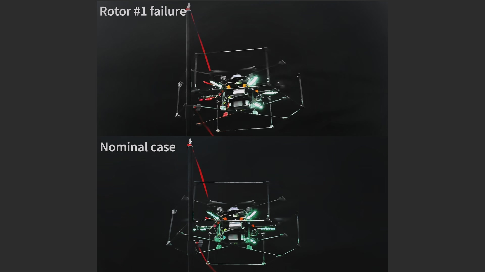
       
      <strong>Tracking Comparison</strong>
    </td>
  </tr>
</table>

### Aerial Writing

Aerial writing is a representative contact-rich aerial-operation task that requires sustained wall contact and accurate full-pose regulation.

<table>
  <tr>
    <td align="center" valign="top" width="50%">
      <video controls preload="metadata" playsinline poster="docs/assets/posters/writing/writing_01.jpg" width="480">
        <source src="docs/assets/videos/writing/writing_01_preview_360p.mp4" type="video/mp4">
        Your viewer does not support embedded video. Please use the download links below.
      </video>
       
      <a href="docs/assets/videos/writing/writing_01_preview_360p.mp4">Preview Video (360p)</a>
       
      <a href="docs/assets/videos/writing/writing_01.mp4">High-resolution download</a>
       
      <strong>Featured Writing Demonstration</strong>
    </td>
    <td align="center" valign="top" width="50%">
      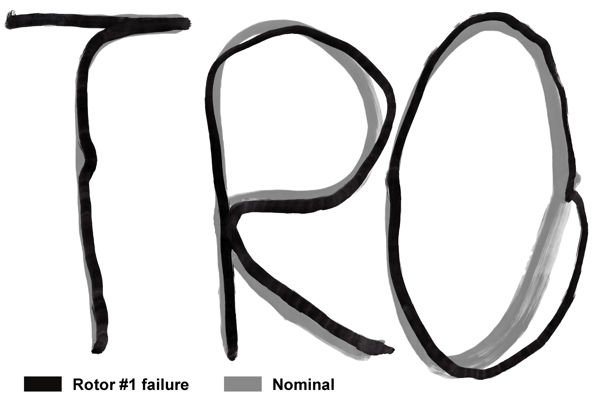
       
      <strong>Result Snapshot</strong>
    </td>
  </tr>
</table>

<table>
  <tr>
    <td align="center" valign="top" width="50%">
      <video controls preload="metadata" playsinline poster="docs/assets/posters/writing/writing_02.jpg" width="480">
        <source src="docs/assets/videos/writing/writing_02_preview_360p.mp4" type="video/mp4">
        Your viewer does not support embedded video. Please use the download links below.
      </video>
       
      <a href="docs/assets/videos/writing/writing_02_preview_360p.mp4">Preview Video (360p)</a>
       
      <a href="docs/assets/videos/writing/writing_02.mp4">High-resolution download</a>
       
      <strong>Without Rotor Failure</strong>
    </td>
    <td align="center" valign="top" width="50%">
      <video controls preload="metadata" playsinline poster="docs/assets/posters/writing/writing_03.jpg" width="480">
        <source src="docs/assets/videos/writing/writing_03_preview_360p.mp4" type="video/mp4">
        Your viewer does not support embedded video. Please use the download links below.
      </video>
       
      <a href="docs/assets/videos/writing/writing_03_preview_360p.mp4">Preview Video (360p)</a>
       
      <a href="docs/assets/videos/writing/writing_03.mp4">High-resolution download</a>
       
      <strong>With Rotor Failure</strong>
    </td>
  </tr>
</table>

## Extended Hovering Results

The hovering comparisons below use low-resolution embedded previews. Under each preview, the original poster image is retained as the corresponding experiment-statistics summary. These hovering trials are also conducted using onboard sensors only.

### 0 deg hovering comparison

Representative case images are reused for symmetric failure sets that share the same clip.

| Failure case | Reference | BTO-CL | BTO-AL | UTO-CL | UTO-AL |
| --- | --- | --- | --- | --- | --- |
| `1 / 4 / 5` | 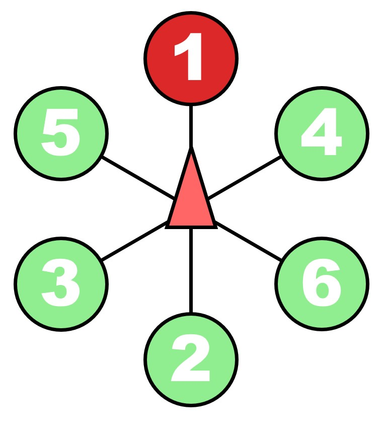 | <video controls preload="metadata" playsinline poster="docs/assets/posters/hover/0deg/BTO-CL/1.jpg" width="560"><source src="docs/assets/videos/hover/0deg/BTO-CL/1_preview_360p.mp4" type="video/mp4"></video>  <a href="docs/assets/videos/hover/0deg/BTO-CL/1.mp4">HD video</a> Success | <video controls preload="metadata" playsinline poster="docs/assets/posters/hover/0deg/BTO-AL/1.jpg" width="560"><source src="docs/assets/videos/hover/0deg/BTO-AL/1_preview_360p.mp4" type="video/mp4"></video> 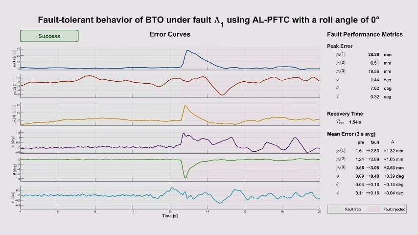 <a href="docs/assets/videos/hover/0deg/BTO-AL/1.mp4">HD video</a> Success | <video controls preload="metadata" playsinline poster="docs/assets/posters/hover/0deg/UTO-CL/1.jpg" width="560"><source src="docs/assets/videos/hover/0deg/UTO-CL/1_preview_360p.mp4" type="video/mp4"></video>  <a href="docs/assets/videos/hover/0deg/UTO-CL/1.mp4">HD video</a> Success | <video controls preload="metadata" playsinline poster="docs/assets/posters/hover/0deg/UTO-AL/1.jpg" width="560"><source src="docs/assets/videos/hover/0deg/UTO-AL/1_preview_360p.mp4" type="video/mp4"></video>  <a href="docs/assets/videos/hover/0deg/UTO-AL/1.mp4">HD video</a> Success |
| `12 / 34` | 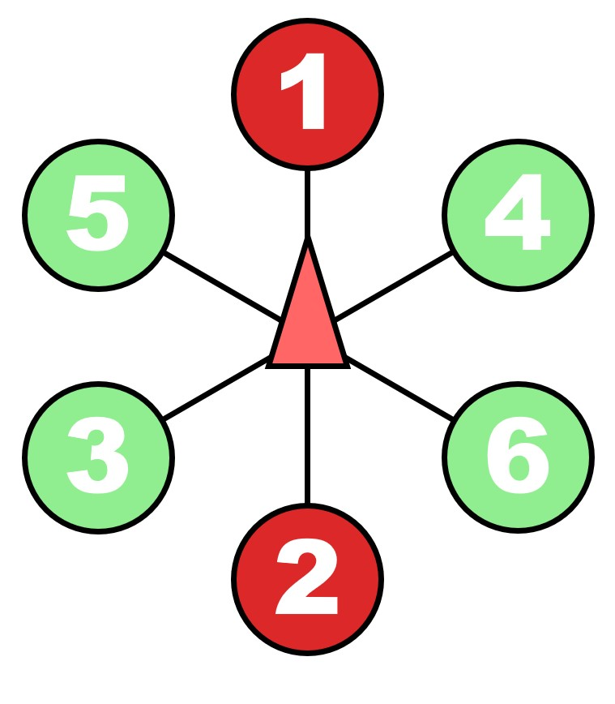 | <video controls preload="metadata" playsinline poster="docs/assets/posters/hover/0deg/BTO-CL/12.jpg" width="560"><source src="docs/assets/videos/hover/0deg/BTO-CL/12_preview_360p.mp4" type="video/mp4"></video>  <a href="docs/assets/videos/hover/0deg/BTO-CL/12.mp4">HD video</a> Success | <video controls preload="metadata" playsinline poster="docs/assets/posters/hover/0deg/BTO-AL/12.jpg" width="560"><source src="docs/assets/videos/hover/0deg/BTO-AL/12_preview_360p.mp4" type="video/mp4"></video> 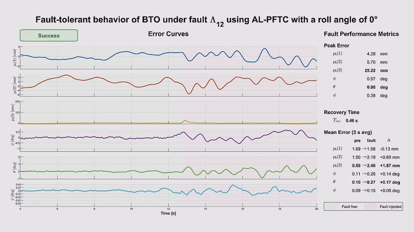 <a href="docs/assets/videos/hover/0deg/BTO-AL/12.mp4">HD video</a> Success | <video controls preload="metadata" playsinline poster="docs/assets/posters/hover/0deg/UTO-CL/12.jpg" width="560"><source src="docs/assets/videos/hover/0deg/UTO-CL/12_preview_360p.mp4" type="video/mp4"></video>  <a href="docs/assets/videos/hover/0deg/UTO-CL/12.mp4">HD video</a> Success | <video controls preload="metadata" playsinline poster="docs/assets/posters/hover/0deg/UTO-AL/12.jpg" width="560"><source src="docs/assets/videos/hover/0deg/UTO-AL/12_preview_360p.mp4" type="video/mp4"></video>  <a href="docs/assets/videos/hover/0deg/UTO-AL/12.mp4">HD video</a> Success |
| `13 / 16 / 36` | 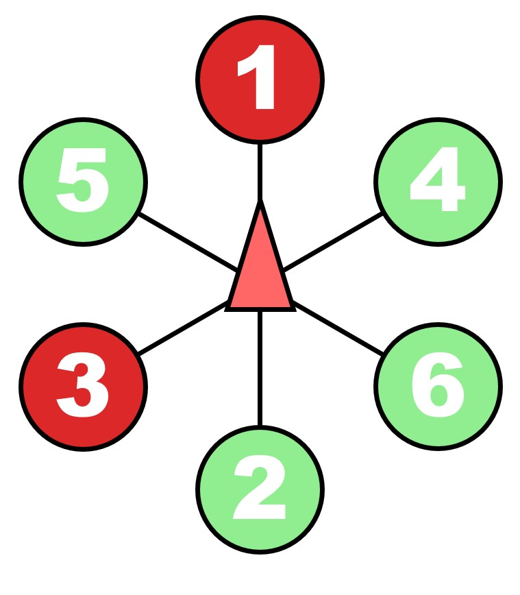 | <video controls preload="metadata" playsinline poster="docs/assets/posters/hover/0deg/BTO-CL/13.jpg" width="560"><source src="docs/assets/videos/hover/0deg/BTO-CL/13_preview_360p.mp4" type="video/mp4"></video>  <a href="docs/assets/videos/hover/0deg/BTO-CL/13.mp4">HD video</a> Failure | <video controls preload="metadata" playsinline poster="docs/assets/posters/hover/0deg/BTO-AL/13.jpg" width="560"><source src="docs/assets/videos/hover/0deg/BTO-AL/13_preview_360p.mp4" type="video/mp4"></video> 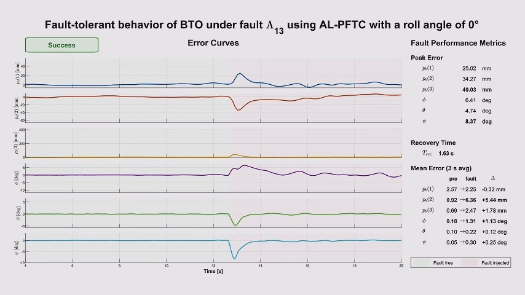 <a href="docs/assets/videos/hover/0deg/BTO-AL/13.mp4">HD video</a> Success | <video controls preload="metadata" playsinline poster="docs/assets/posters/hover/0deg/UTO-CL/13.jpg" width="560"><source src="docs/assets/videos/hover/0deg/UTO-CL/13_preview_360p.mp4" type="video/mp4"></video>  <a href="docs/assets/videos/hover/0deg/UTO-CL/13.mp4">HD video</a> Failure | <video controls preload="metadata" playsinline poster="docs/assets/posters/hover/0deg/UTO-AL/13.jpg" width="560"><source src="docs/assets/videos/hover/0deg/UTO-AL/13_preview_360p.mp4" type="video/mp4"></video>  <a href="docs/assets/videos/hover/0deg/UTO-AL/13.mp4">HD video</a> Success |
| `136` | 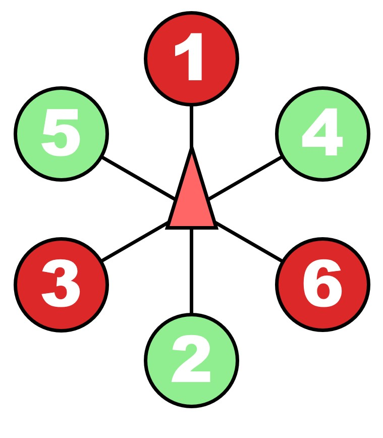 | <video controls preload="metadata" playsinline poster="docs/assets/posters/hover/0deg/BTO-CL/136.jpg" width="560"><source src="docs/assets/videos/hover/0deg/BTO-CL/136_preview_360p.mp4" type="video/mp4"></video>  <a href="docs/assets/videos/hover/0deg/BTO-CL/136.mp4">HD video</a> Failure | <video controls preload="metadata" playsinline poster="docs/assets/posters/hover/0deg/BTO-AL/136.jpg" width="560"><source src="docs/assets/videos/hover/0deg/BTO-AL/136_preview_360p.mp4" type="video/mp4"></video> 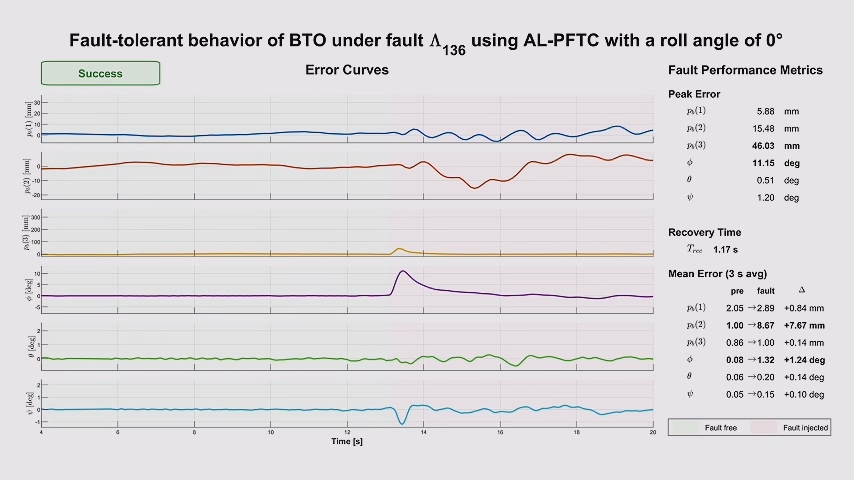 <a href="docs/assets/videos/hover/0deg/BTO-AL/136.mp4">HD video</a> Success | <video controls preload="metadata" playsinline poster="docs/assets/posters/hover/0deg/UTO-CL/136.jpg" width="560"><source src="docs/assets/videos/hover/0deg/UTO-CL/136_preview_360p.mp4" type="video/mp4"></video>  <a href="docs/assets/videos/hover/0deg/UTO-CL/136.mp4">HD video</a> Failure | <video controls preload="metadata" playsinline poster="docs/assets/posters/hover/0deg/UTO-AL/136.jpg" width="560"><source src="docs/assets/videos/hover/0deg/UTO-AL/136_preview_360p.mp4" type="video/mp4"></video>  <a href="docs/assets/videos/hover/0deg/UTO-AL/136.mp4">HD video</a> Success |

### 45 deg hovering comparison

| Failure case | Reference | BTO-CL | BTO-AL | UTO-CL | UTO-AL |
| --- | --- | --- | --- | --- | --- |
| `1` |  | <video controls preload="metadata" playsinline poster="docs/assets/posters/hover/45deg/BTO-CL/1.jpg" width="560"><source src="docs/assets/videos/hover/45deg/BTO-CL/1_preview_360p.mp4" type="video/mp4"></video> 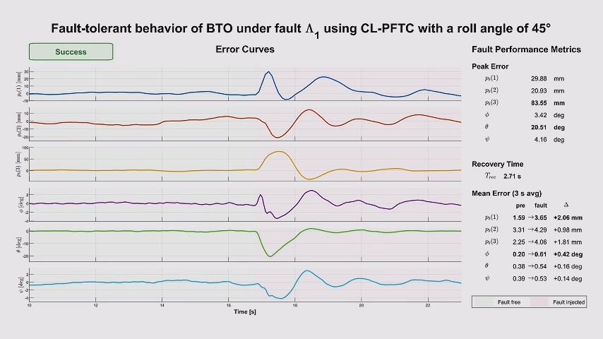 <a href="docs/assets/videos/hover/45deg/BTO-CL/1.mp4">HD video</a> Success | <video controls preload="metadata" playsinline poster="docs/assets/posters/hover/45deg/BTO-AL/1.jpg" width="560"><source src="docs/assets/videos/hover/45deg/BTO-AL/1_preview_360p.mp4" type="video/mp4"></video> 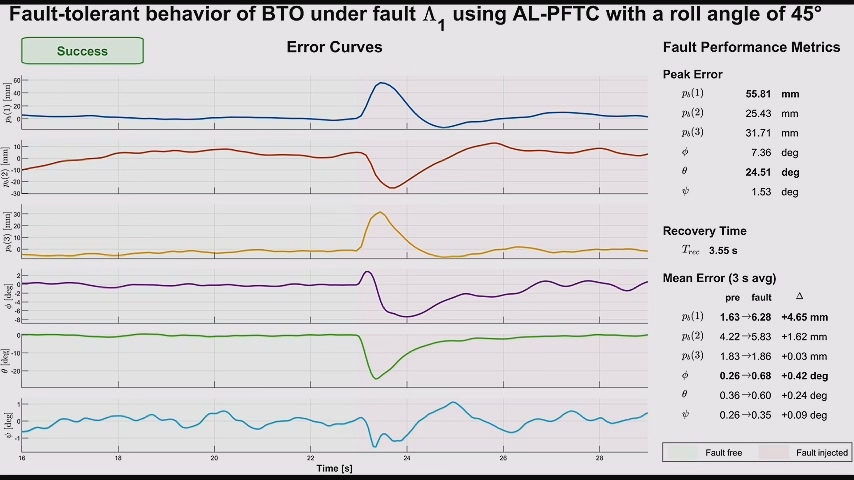 <a href="docs/assets/videos/hover/45deg/BTO-AL/1.mp4">HD video</a> Success | <video controls preload="metadata" playsinline poster="docs/assets/posters/hover/45deg/UTO-CL/1.jpg" width="560"><source src="docs/assets/videos/hover/45deg/UTO-CL/1_preview_360p.mp4" type="video/mp4"></video>  <a href="docs/assets/videos/hover/45deg/UTO-CL/1.mp4">HD video</a> Failure | <video controls preload="metadata" playsinline poster="docs/assets/posters/hover/45deg/UTO-AL/1.jpg" width="560"><source src="docs/assets/videos/hover/45deg/UTO-AL/1_preview_360p.mp4" type="video/mp4"></video> 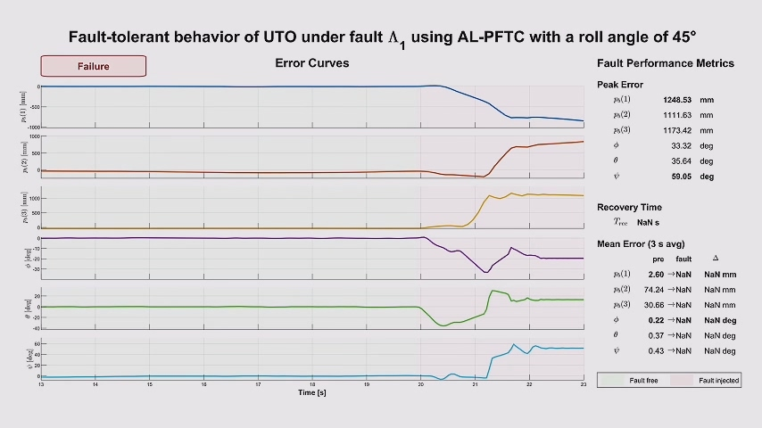 <a href="docs/assets/videos/hover/45deg/UTO-AL/1.mp4">HD video</a> Failure |
| `4` | 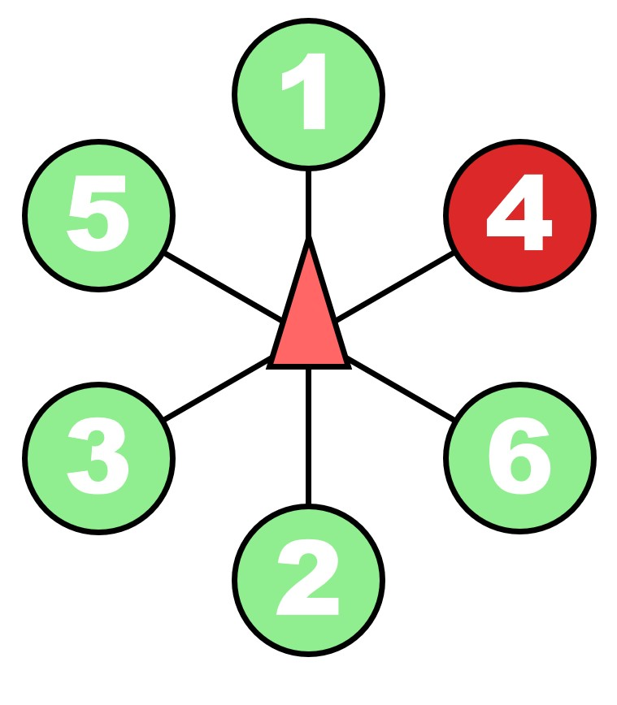 | <video controls preload="metadata" playsinline poster="docs/assets/posters/hover/45deg/BTO-CL/4.jpg" width="560"><source src="docs/assets/videos/hover/45deg/BTO-CL/4_preview_360p.mp4" type="video/mp4"></video> 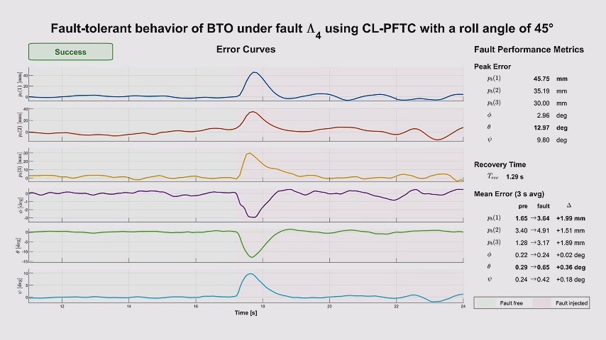 <a href="docs/assets/videos/hover/45deg/BTO-CL/4.mp4">HD video</a> Success | <video controls preload="metadata" playsinline poster="docs/assets/posters/hover/45deg/BTO-AL/4.jpg" width="560"><source src="docs/assets/videos/hover/45deg/BTO-AL/4_preview_360p.mp4" type="video/mp4"></video> 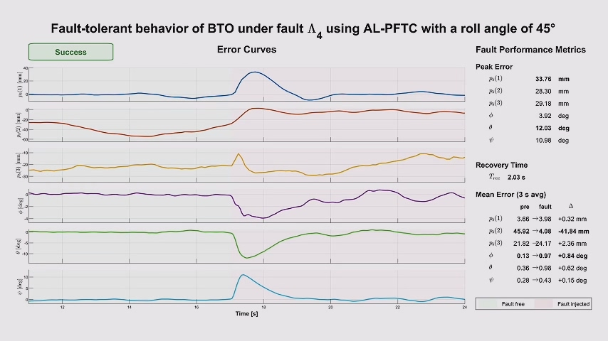 <a href="docs/assets/videos/hover/45deg/BTO-AL/4.mp4">HD video</a> Success | <video controls preload="metadata" playsinline poster="docs/assets/posters/hover/45deg/UTO-CL/4.jpg" width="560"><source src="docs/assets/videos/hover/45deg/UTO-CL/4_preview_360p.mp4" type="video/mp4"></video>  <a href="docs/assets/videos/hover/45deg/UTO-CL/4.mp4">HD video</a> Failure | <video controls preload="metadata" playsinline poster="docs/assets/posters/hover/45deg/UTO-AL/4.jpg" width="560"><source src="docs/assets/videos/hover/45deg/UTO-AL/4_preview_360p.mp4" type="video/mp4"></video> 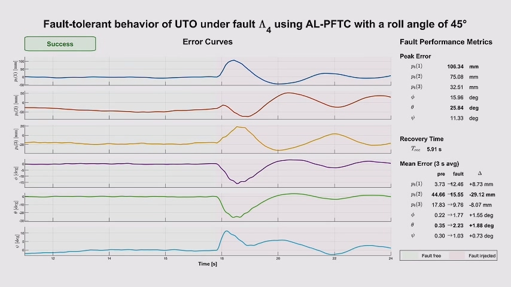 <a href="docs/assets/videos/hover/45deg/UTO-AL/4.mp4">HD video</a> Success |
| `5` | 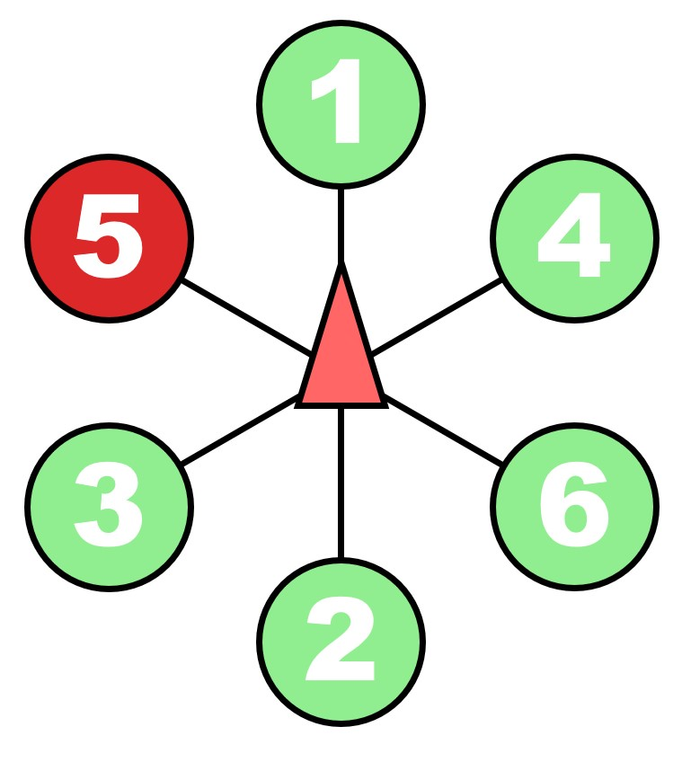 | <video controls preload="metadata" playsinline poster="docs/assets/posters/hover/45deg/BTO-CL/5.jpg" width="560"><source src="docs/assets/videos/hover/45deg/BTO-CL/5_preview_360p.mp4" type="video/mp4"></video> 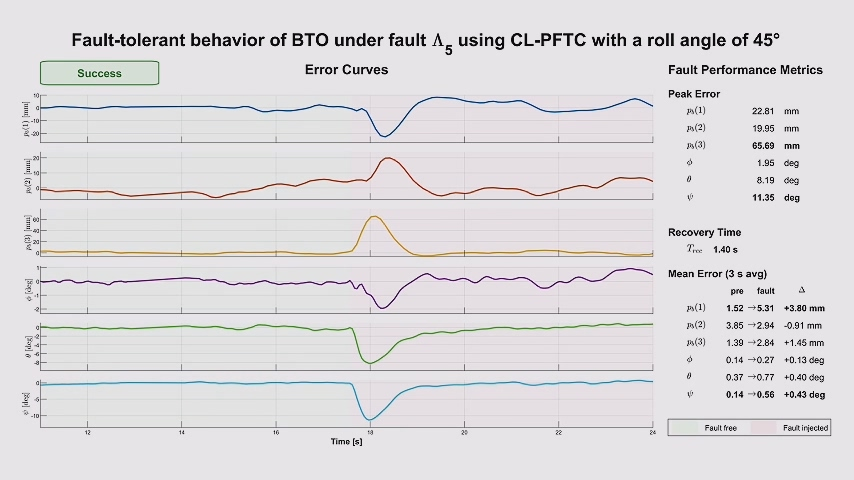 <a href="docs/assets/videos/hover/45deg/BTO-CL/5.mp4">HD video</a> Success | <video controls preload="metadata" playsinline poster="docs/assets/posters/hover/45deg/BTO-AL/5.jpg" width="560"><source src="docs/assets/videos/hover/45deg/BTO-AL/5_preview_360p.mp4" type="video/mp4"></video> 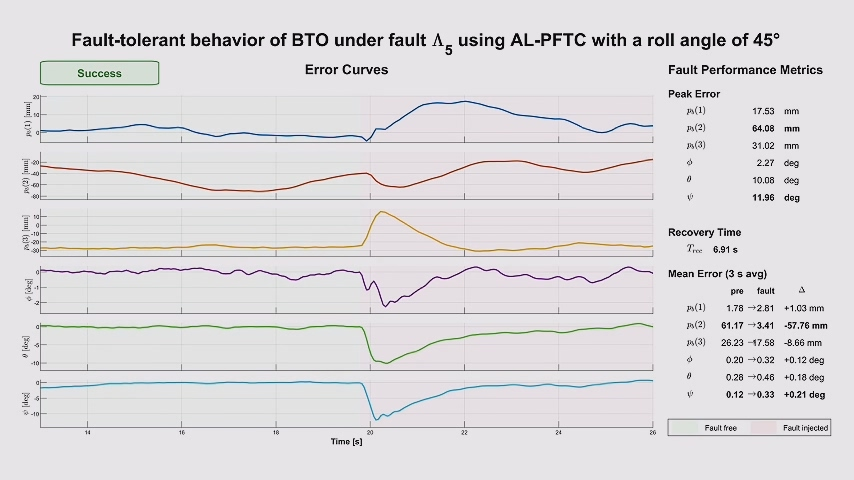 <a href="docs/assets/videos/hover/45deg/BTO-AL/5.mp4">HD video</a> Success | <video controls preload="metadata" playsinline poster="docs/assets/posters/hover/45deg/UTO-CL/5.jpg" width="560"><source src="docs/assets/videos/hover/45deg/UTO-CL/5_preview_360p.mp4" type="video/mp4"></video>  <a href="docs/assets/videos/hover/45deg/UTO-CL/5.mp4">HD video</a> Success | <video controls preload="metadata" playsinline poster="docs/assets/posters/hover/45deg/UTO-AL/5.jpg" width="560"><source src="docs/assets/videos/hover/45deg/UTO-AL/5_preview_360p.mp4" type="video/mp4"></video> 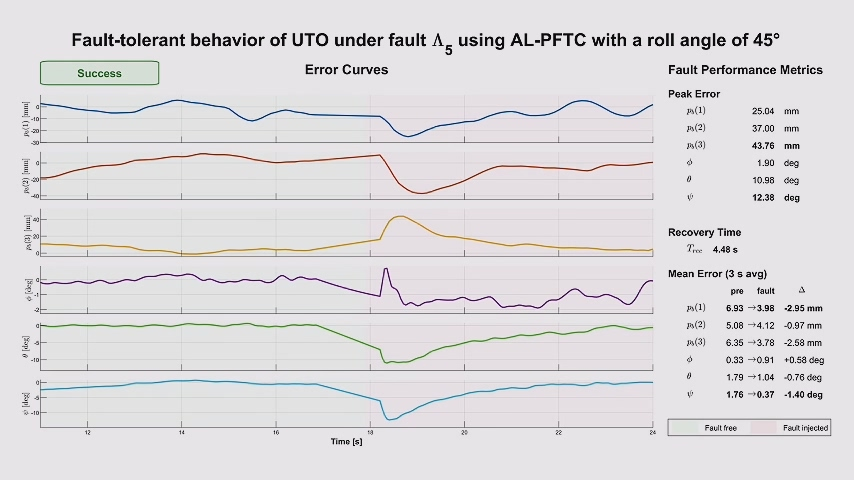 <a href="docs/assets/videos/hover/45deg/UTO-AL/5.mp4">HD video</a> Success |
| `12` |  | <video controls preload="metadata" playsinline poster="docs/assets/posters/hover/45deg/BTO-CL/12.jpg" width="560"><source src="docs/assets/videos/hover/45deg/BTO-CL/12_preview_360p.mp4" type="video/mp4"></video> 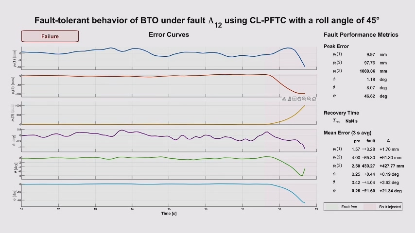 <a href="docs/assets/videos/hover/45deg/BTO-CL/12.mp4">HD video</a> Failure | <video controls preload="metadata" playsinline poster="docs/assets/posters/hover/45deg/BTO-AL/12.jpg" width="560"><source src="docs/assets/videos/hover/45deg/BTO-AL/12_preview_360p.mp4" type="video/mp4"></video> 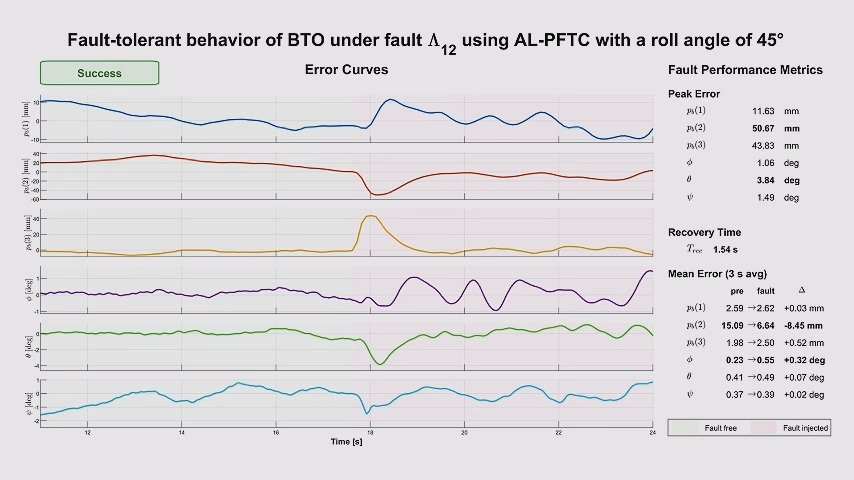 <a href="docs/assets/videos/hover/45deg/BTO-AL/12.mp4">HD video</a> Success | <video controls preload="metadata" playsinline poster="docs/assets/posters/hover/45deg/UTO-CL/12.jpg" width="560"><source src="docs/assets/videos/hover/45deg/UTO-CL/12_preview_360p.mp4" type="video/mp4"></video>  <a href="docs/assets/videos/hover/45deg/UTO-CL/12.mp4">HD video</a> Failure | <video controls preload="metadata" playsinline poster="docs/assets/posters/hover/45deg/UTO-AL/12.jpg" width="560"><source src="docs/assets/videos/hover/45deg/UTO-AL/12_preview_360p.mp4" type="video/mp4"></video> 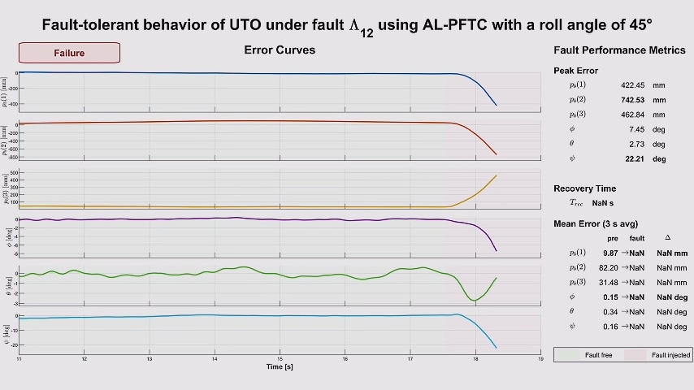 <a href="docs/assets/videos/hover/45deg/UTO-AL/12.mp4">HD video</a> Failure |
| `34` | 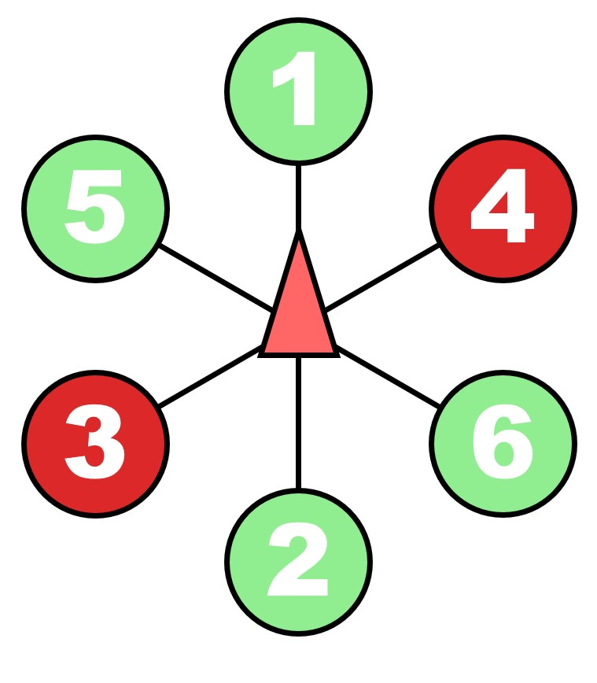 | <video controls preload="metadata" playsinline poster="docs/assets/posters/hover/45deg/BTO-CL/34.jpg" width="560"><source src="docs/assets/videos/hover/45deg/BTO-CL/34_preview_360p.mp4" type="video/mp4"></video> 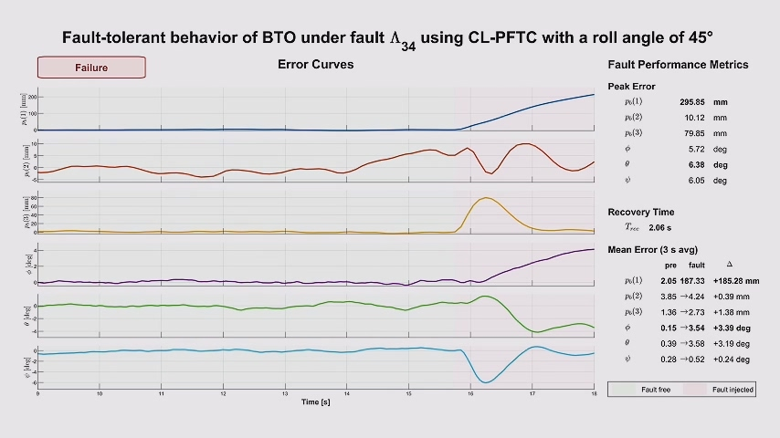 <a href="docs/assets/videos/hover/45deg/BTO-CL/34.mp4">HD video</a> Failure | <video controls preload="metadata" playsinline poster="docs/assets/posters/hover/45deg/BTO-AL/34.jpg" width="560"><source src="docs/assets/videos/hover/45deg/BTO-AL/34_preview_360p.mp4" type="video/mp4"></video> 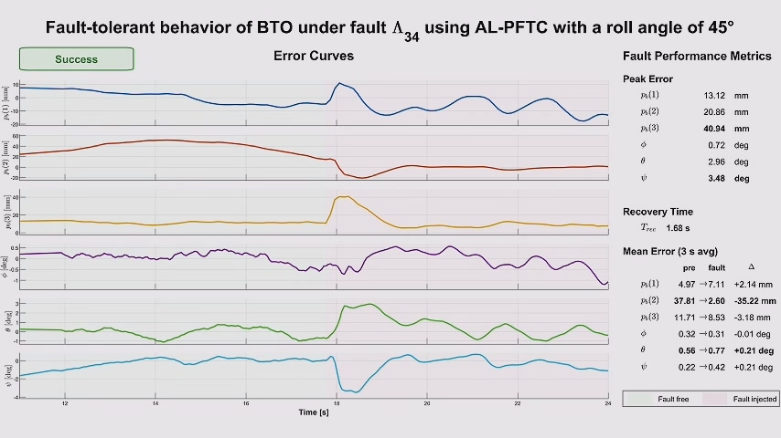 <a href="docs/assets/videos/hover/45deg/BTO-AL/34.mp4">HD video</a> Success | <video controls preload="metadata" playsinline poster="docs/assets/posters/hover/45deg/UTO-CL/34.jpg" width="560"><source src="docs/assets/videos/hover/45deg/UTO-CL/34_preview_360p.mp4" type="video/mp4"></video>  <a href="docs/assets/videos/hover/45deg/UTO-CL/34.mp4">HD video</a> Failure | <video controls preload="metadata" playsinline poster="docs/assets/posters/hover/45deg/UTO-AL/34.jpg" width="560"><source src="docs/assets/videos/hover/45deg/UTO-AL/34_preview_360p.mp4" type="video/mp4"></video> 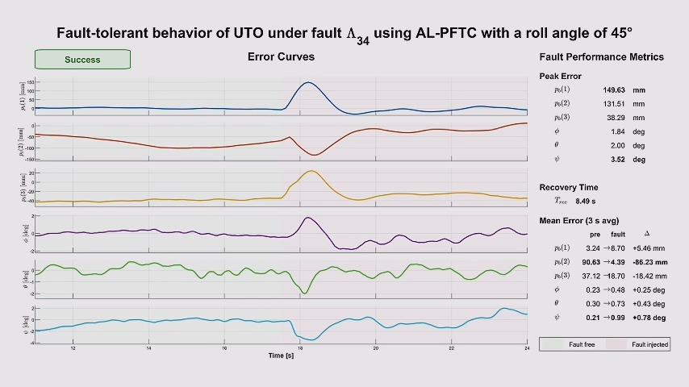 <a href="docs/assets/videos/hover/45deg/UTO-AL/34.mp4">HD video</a> Success |
| `13` |  | <video controls preload="metadata" playsinline poster="docs/assets/posters/hover/45deg/BTO-CL/13.jpg" width="560"><source src="docs/assets/videos/hover/45deg/BTO-CL/13_preview_360p.mp4" type="video/mp4"></video> 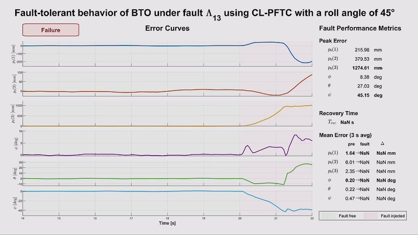 <a href="docs/assets/videos/hover/45deg/BTO-CL/13.mp4">HD video</a> Failure | <video controls preload="metadata" playsinline poster="docs/assets/posters/hover/45deg/BTO-AL/13.jpg" width="560"><source src="docs/assets/videos/hover/45deg/BTO-AL/13_preview_360p.mp4" type="video/mp4"></video> 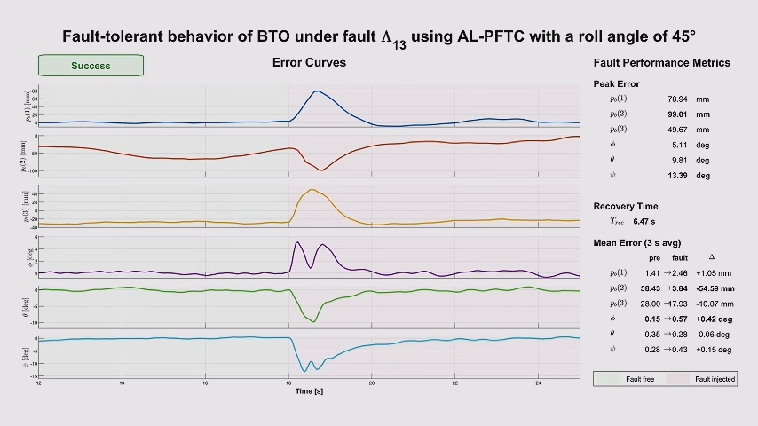 <a href="docs/assets/videos/hover/45deg/BTO-AL/13.mp4">HD video</a> Success | <video controls preload="metadata" playsinline poster="docs/assets/posters/hover/45deg/UTO-CL/13.jpg" width="560"><source src="docs/assets/videos/hover/45deg/UTO-CL/13_preview_360p.mp4" type="video/mp4"></video>  <a href="docs/assets/videos/hover/45deg/UTO-CL/13.mp4">HD video</a> Failure | <video controls preload="metadata" playsinline poster="docs/assets/posters/hover/45deg/UTO-AL/13.jpg" width="560"><source src="docs/assets/videos/hover/45deg/UTO-AL/13_preview_360p.mp4" type="video/mp4"></video> 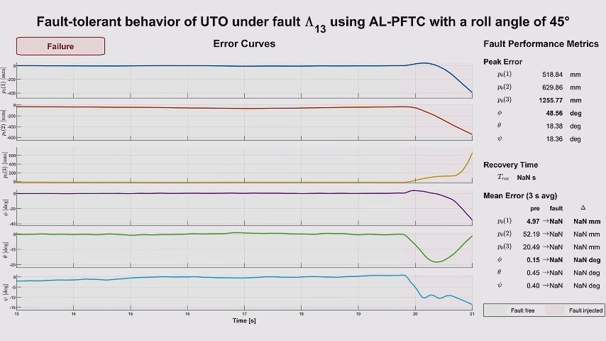 <a href="docs/assets/videos/hover/45deg/UTO-AL/13.mp4">HD video</a> Failure |
| `16` | 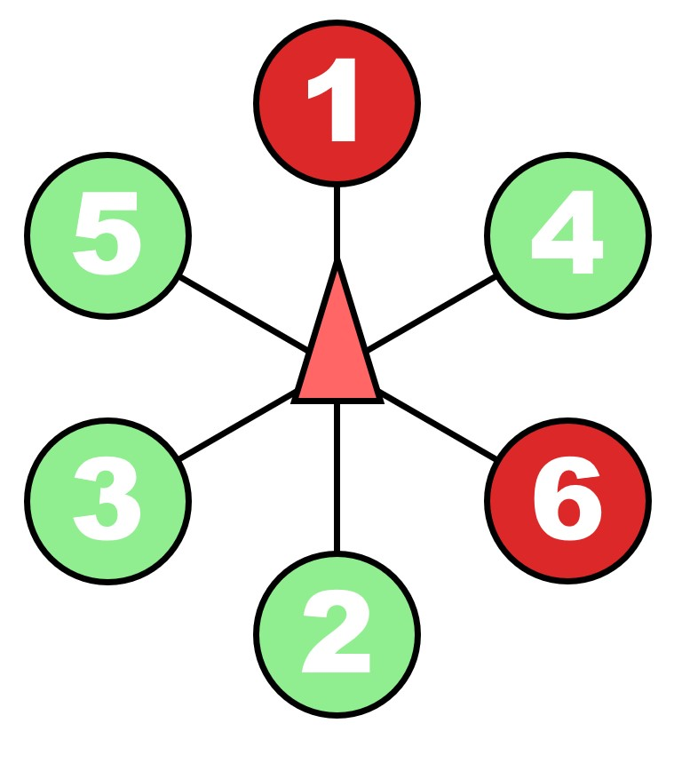 | <video controls preload="metadata" playsinline poster="docs/assets/posters/hover/45deg/BTO-CL/16.jpg" width="560"><source src="docs/assets/videos/hover/45deg/BTO-CL/16_preview_360p.mp4" type="video/mp4"></video> 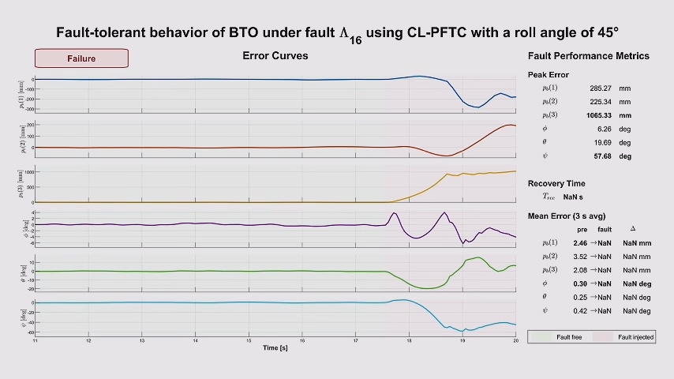 <a href="docs/assets/videos/hover/45deg/BTO-CL/16.mp4">HD video</a> Failure | <video controls preload="metadata" playsinline poster="docs/assets/posters/hover/45deg/BTO-AL/16.jpg" width="560"><source src="docs/assets/videos/hover/45deg/BTO-AL/16_preview_360p.mp4" type="video/mp4"></video> 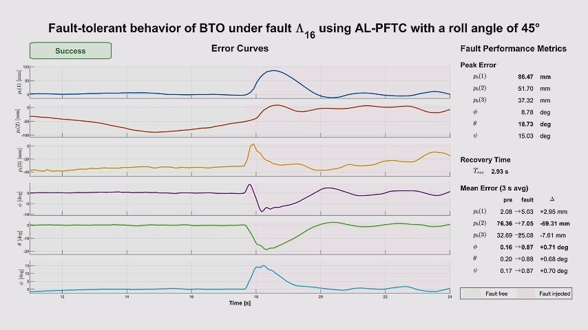 <a href="docs/assets/videos/hover/45deg/BTO-AL/16.mp4">HD video</a> Success | <video controls preload="metadata" playsinline poster="docs/assets/posters/hover/45deg/UTO-CL/16.jpg" width="560"><source src="docs/assets/videos/hover/45deg/UTO-CL/16_preview_360p.mp4" type="video/mp4"></video>  <a href="docs/assets/videos/hover/45deg/UTO-CL/16.mp4">HD video</a> Failure | <video controls preload="metadata" playsinline poster="docs/assets/posters/hover/45deg/UTO-AL/16.jpg" width="560"><source src="docs/assets/videos/hover/45deg/UTO-AL/16_preview_360p.mp4" type="video/mp4"></video> 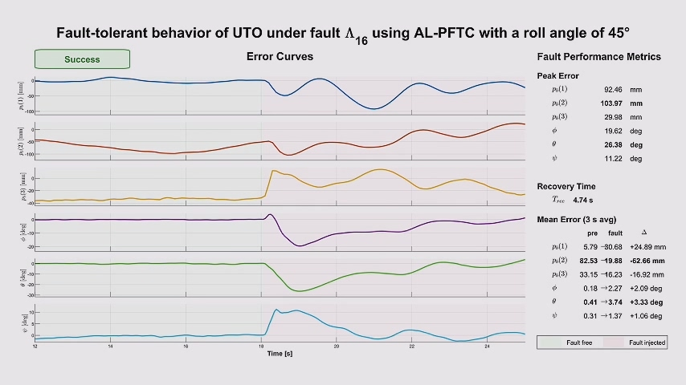 <a href="docs/assets/videos/hover/45deg/UTO-AL/16.mp4">HD video</a> Success |
| `36` | 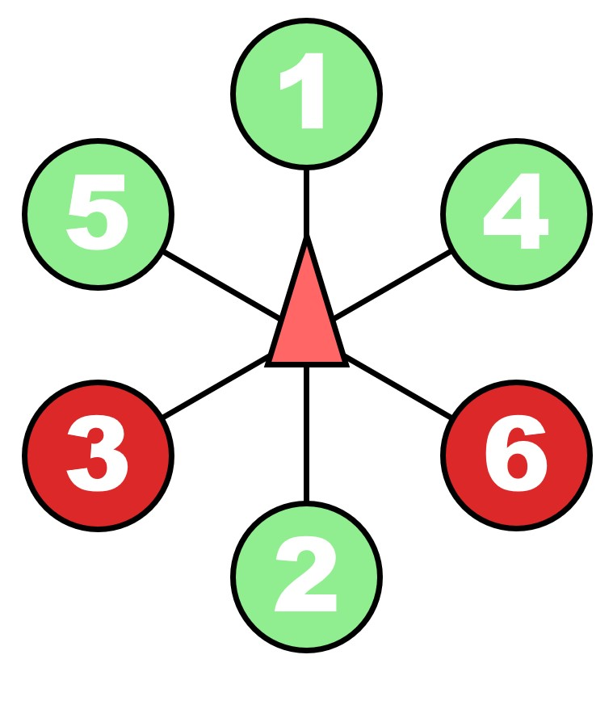 | <video controls preload="metadata" playsinline poster="docs/assets/posters/hover/45deg/BTO-CL/36.jpg" width="560"><source src="docs/assets/videos/hover/45deg/BTO-CL/36_preview_360p.mp4" type="video/mp4"></video> 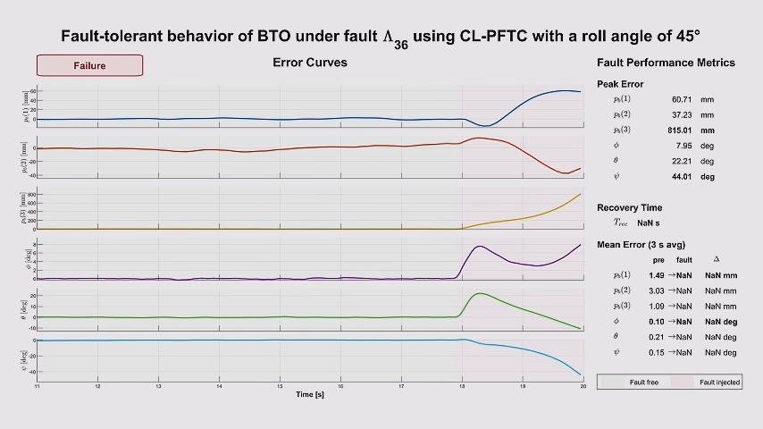 <a href="docs/assets/videos/hover/45deg/BTO-CL/36.mp4">HD video</a> Failure | <video controls preload="metadata" playsinline poster="docs/assets/posters/hover/45deg/BTO-AL/36.jpg" width="560"><source src="docs/assets/videos/hover/45deg/BTO-AL/36_preview_360p.mp4" type="video/mp4"></video> 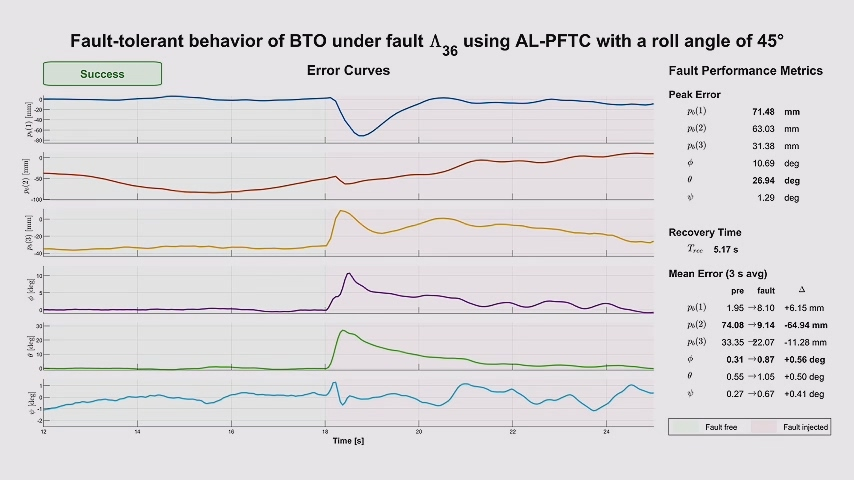 <a href="docs/assets/videos/hover/45deg/BTO-AL/36.mp4">HD video</a> Success | <video controls preload="metadata" playsinline poster="docs/assets/posters/hover/45deg/UTO-CL/36.jpg" width="560"><source src="docs/assets/videos/hover/45deg/UTO-CL/36_preview_360p.mp4" type="video/mp4"></video>  <a href="docs/assets/videos/hover/45deg/UTO-CL/36.mp4">HD video</a> Failure | <video controls preload="metadata" playsinline poster="docs/assets/posters/hover/45deg/UTO-AL/36.jpg" width="560"><source src="docs/assets/videos/hover/45deg/UTO-AL/36_preview_360p.mp4" type="video/mp4"></video> 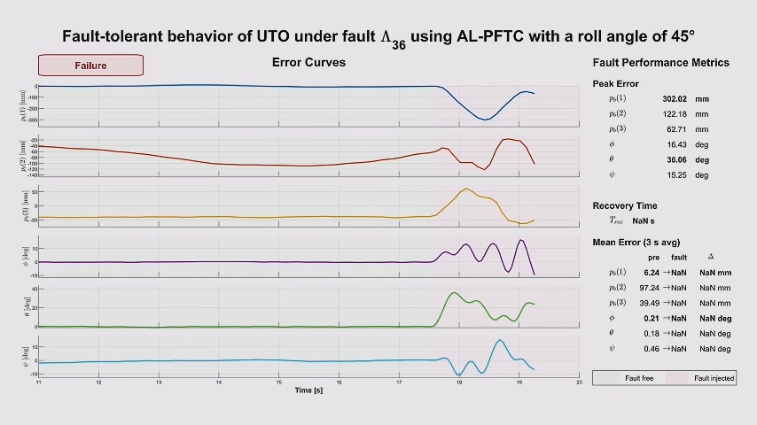 <a href="docs/assets/videos/hover/45deg/UTO-AL/36.mp4">HD video</a> Failure |
| `136` |  | <video controls preload="metadata" playsinline poster="docs/assets/posters/hover/45deg/BTO-CL/136.jpg" width="560"><source src="docs/assets/videos/hover/45deg/BTO-CL/136_preview_360p.mp4" type="video/mp4"></video> 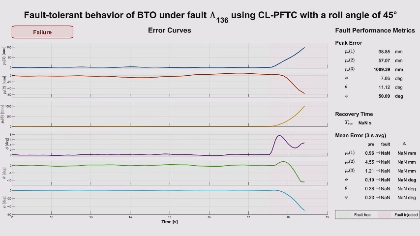 <a href="docs/assets/videos/hover/45deg/BTO-CL/136.mp4">HD video</a> Failure | <video controls preload="metadata" playsinline poster="docs/assets/posters/hover/45deg/BTO-AL/136.jpg" width="560"><source src="docs/assets/videos/hover/45deg/BTO-AL/136_preview_360p.mp4" type="video/mp4"></video> 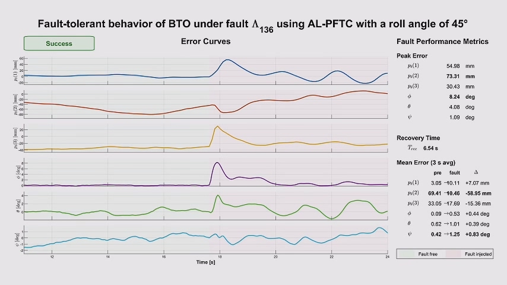 <a href="docs/assets/videos/hover/45deg/BTO-AL/136.mp4">HD video</a> Success | <video controls preload="metadata" playsinline poster="docs/assets/posters/hover/45deg/UTO-CL/136.jpg" width="560"><source src="docs/assets/videos/hover/45deg/UTO-CL/136_preview_360p.mp4" type="video/mp4"></video>  <a href="docs/assets/videos/hover/45deg/UTO-CL/136.mp4">HD video</a> Failure | <video controls preload="metadata" playsinline poster="docs/assets/posters/hover/45deg/UTO-AL/136.jpg" width="560"><source src="docs/assets/videos/hover/45deg/UTO-AL/136_preview_360p.mp4" type="video/mp4"></video> 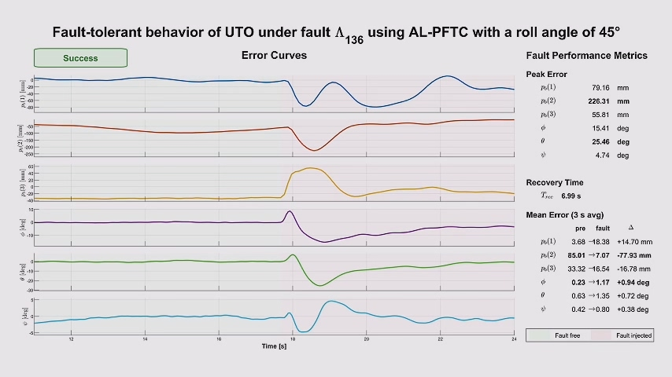 <a href="docs/assets/videos/hover/45deg/UTO-AL/136.mp4">HD video</a> Success |

## Notes

- README rendering cannot preserve the full CSS and JavaScript behavior of the original page, so the main video, experiment-highlight videos, and hover results all use low-resolution embedded previews. Hover results additionally retain the statistics posters below each preview, and all sections keep HD download links.
